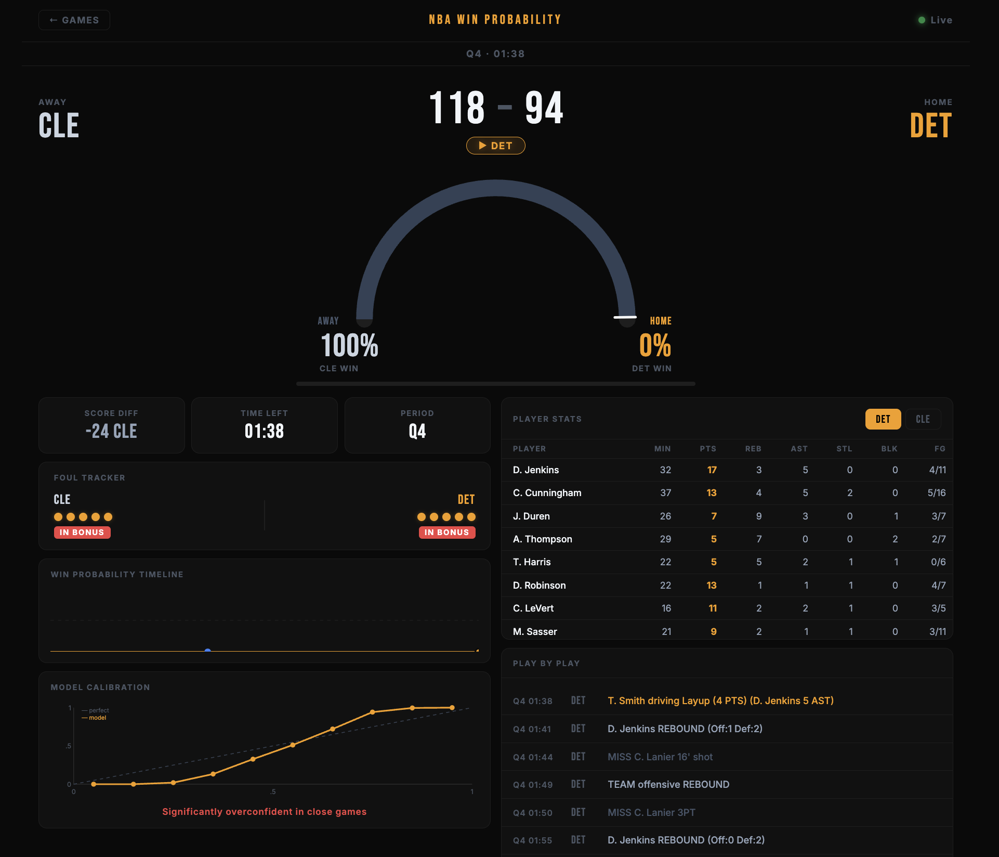
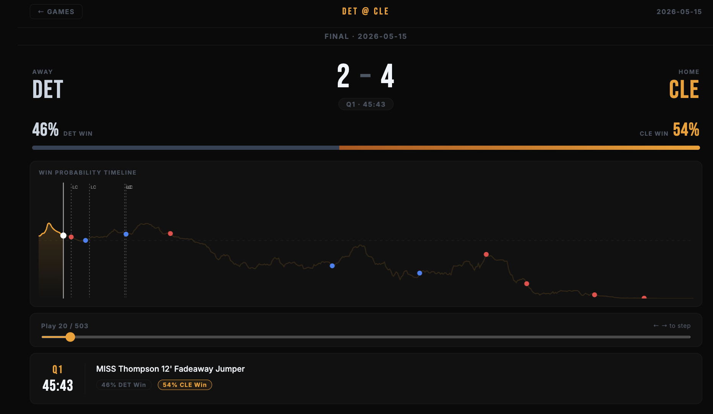

# NBA Win Probability Predictor

A real-time NBA win probability engine built with a GRU sequence model, live play-by-play data, and a WebSocket-powered dashboard.

Unlike single-snapshot models, this system feeds the **last 20 plays as a sequence** into a GRU network — capturing momentum, shooting runs, and foul trouble as they develop, not just the scoreboard at one frozen moment.

  

| Live game | Game replay |
|---|---|
|  |  |

---

## How It Works

```
NBA API  →  collect.py  →  play_by_play.csv
                                  ↓
                            train.py  →  model.pth + scaler.json
                                                ↓
              live NBA CDN  →  server.py  →  WebSocket push  →  dashboard
```

**Three phases:**

1. **Collect** — pulls `PlayByPlayV3` for every game in the target seasons, engineers features for each event, and writes a labeled CSV
2. **Train** — groups events into 20-play sequences per game, trains a GRU, saves weights and normalization params
3. **Serve** — Flask + SocketIO server polls the live NBA CDN every 5 seconds and pushes updated win probabilities to the browser

---

## Features

### Model inputs (12 features per play)
| Feature | Description |
|---|---|
| `score_diff` | Home minus away points |
| `seconds_left` | Total seconds remaining in game |
| `home_possession` | 1 if home team has the ball |
| `home_in_bonus` / `away_in_bonus` | Whether each team is in the foul bonus |
| `home_timeouts` / `away_timeouts` | Timeouts remaining (7 reg, 3 OT) |
| `home_fg_pct` / `away_fg_pct` | Rolling in-game field goal percentage |
| `home_foul_trouble` / `away_foul_trouble` | Players on each team with 4+ fouls |
| `momentum` | Last 5 scoring possessions (+1 home, −1 away) |

### Architecture
- **GRU** with hidden size 64, 2 layers, dropout 0.2
- Sequences of the last 20 plays per game (zero-padded at game start)
- Train/val split by **game** (not by row) to prevent data leakage
- Early stopping with patience 5

### Dashboard
- Live win probability line chart updating every 5 seconds via WebSocket
- Play-by-play feed with key moment annotations (lead changes, scoring runs)
- Player stats box — select home or away team to see live box score
- Historical replay — load any past game by ID and scrub through its win probability curve
- Calibration curve — predicted probability vs actual win rate, with overconfidence diagnosis

### API
| Endpoint | Description |
|---|---|
| `GET /games` | Today's live games and their status |
| `GET /recent-games` | Last 15 completed games (for historical lookup) |
| `GET /game/<game_id>` | Full win probability curve for any past game |
| `GET /boxscore/<game_id>` | Live player stats for a game |
| `GET /calibration` | Model calibration data (cached after first call) |
| `POST /predict` | Snapshot prediction from a single JSON game state (see note below) |
| `WS subscribe` | Subscribe to live updates for a game (full sequence model) |

---

## Setup

### Requirements
- Python 3.11+

```bash
git clone https://github.com/Josephattie0/nba-win-probability
cd nba-win-probability
python -m venv venv && source venv/bin/activate
pip install -r requirements.txt
```

### Environment
```bash
cp .env.example .env
# Edit .env and set FLASK_SECRET_KEY
```

### Run the pipeline

**Step 1 — Collect data** (defaults to 5 seasons: 2020-21 through 2024-25)
```bash
python src/collect.py

# Custom seasons:
python src/collect.py --seasons 2023-24 2024-25

# Quick smoke test with 50 games:
python src/collect.py --max-games 50
```

**Step 2 — Train**
```bash
python src/train.py

# Custom hyperparameters:
python src/train.py --epochs 50 --lr 1e-3 --seq-len 20 --stride 5
```

**Step 3 — Serve**
```bash
python src/server.py
# Open http://localhost:5001
```

---

## Project Structure

```
nba-win-probability/
├── src/
│   ├── collect.py      # Phase 1: data collection + feature engineering
│   ├── features.py     # Feature computation from raw play-by-play
│   ├── train.py        # Phase 2: GRU training
│   ├── predict.py      # Phase 2: inference with rolling sequence window
│   └── server.py       # Phase 3: Flask + WebSocket server
├── dashboard/
│   └── index.html      # Single-file dashboard — CSS, JS, and HTML in one file, no build step, no framework
├── data/               # Generated — gitignored
│   ├── play_by_play.csv
│   ├── model.pth
│   └── scaler.json
├── .env.example
├── requirements.txt
└── README.md
```

---

## One-shot prediction (REST)

> **Snapshot mode caveat:** `POST /predict` runs the GRU on a single frame padded with 19 zero frames — the model sees `[0, 0, …, 0, your_input]` instead of a real 20-play sequence. It still returns a sensible probability (the GRU degrades gracefully to the snapshot), but it misses the momentum signal the model was actually trained to capture. The live WebSocket feed is where the sequence advantage shows up, since the server maintains a rolling 20-play window per game. Use `/predict` for quick sanity checks or API integration tests, not for evaluating model quality.

```bash
curl -X POST http://localhost:5001/predict \
  -H "Content-Type: application/json" \
  -d '{
    "score_diff": 5,
    "seconds_left": 120,
    "home_possession": 1,
    "home_in_bonus": 0,
    "away_in_bonus": 1,
    "home_timeouts": 2,
    "away_timeouts": 3,
    "home_fg_pct": 0.47,
    "away_fg_pct": 0.44,
    "home_foul_trouble": 0,
    "away_foul_trouble": 1,
    "momentum": 2
  }'
```

```json
{"home_win_prob": 0.831, "away_win_prob": 0.169}
```

---

## Data source

Play-by-play data is pulled from the [nba_api](https://github.com/swar/nba_api) Python package, which wraps the public NBA stats endpoints. Live game data is fetched from the NBA's public CDN (`cdn.nba.com`).

---

## Notes

- The NBA API is rate-limited. `collect.py` waits 0.7 seconds between requests by default
- Live data is only available for today's games. For past games, use `GET /game/<game_id>`
- The model is retrained from scratch each time you run `train.py` — old weights are overwritten
- `data/` is gitignored; you need to run the full pipeline to generate it
- **Early-game predictions are noisier.** The GRU requires a 20-play sequence; during the first 19 plays of a game the window is zero-padded. The model was trained on real sequences, so predictions in the first few minutes carry more uncertainty than mid- or late-game predictions where a full window is available.
